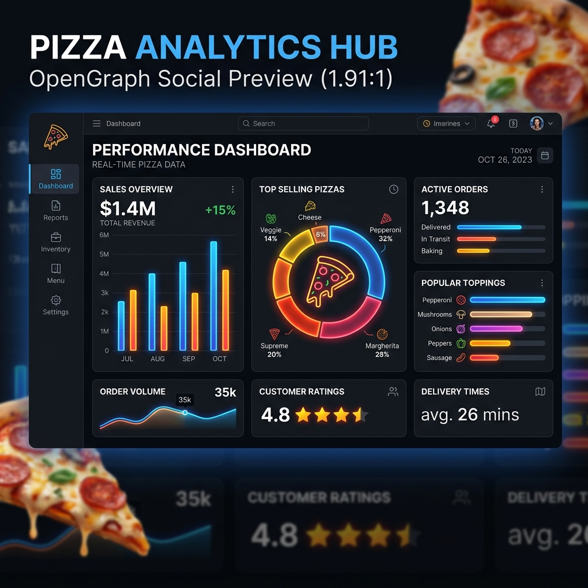
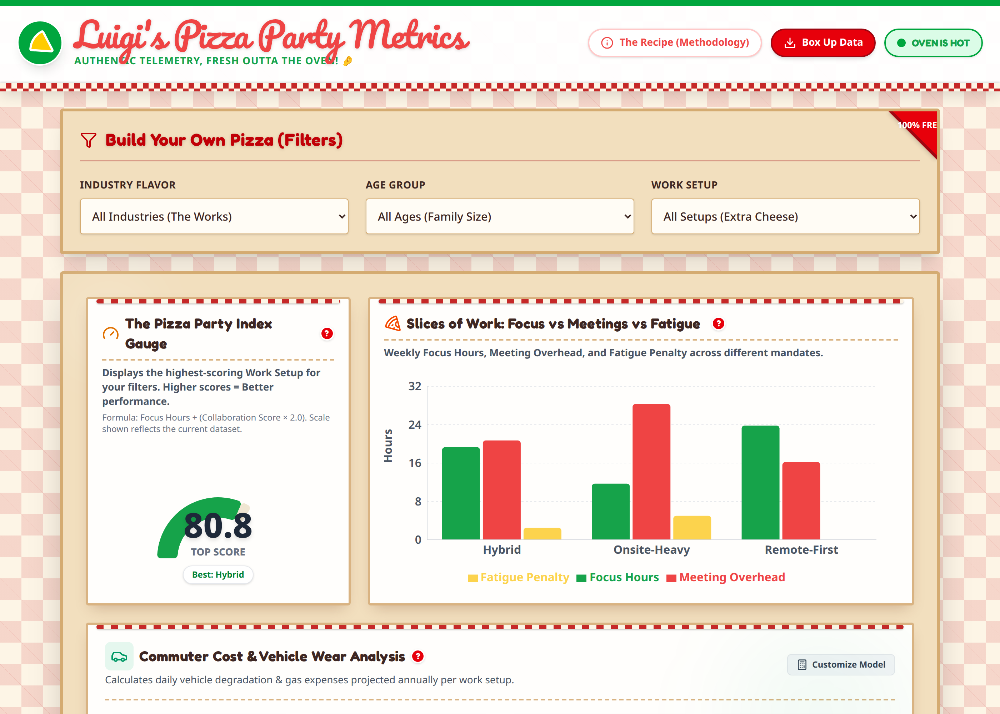

<p align="center">
  
</p>

<h1 align="center">🍕 Pizza Party Metrics (PPM)</h1>

<p align="center"><em>Mamma mia! Checking the "come back for the culture (and the pizza parties)" return-to-office pitch against cold, hard, freshly-baked data.</em> 🤌</p>

<p align="center">
  <a href="https://github.com/howlcipher/pizza_party_metrics/actions/workflows/deploy.yml"></a>
  
  
  
  
  
</p>

<p align="center">
  <a href="https://howlcipher.github.io/pizza_party_metrics/"><strong>🍕 Try the live dashboard →</strong></a>
</p>

Every return-to-office memo says the same thing: come back for the culture — the collaboration, the energy, the pizza parties. **Pizza Party Metrics** checks that pitch against real data. We fuse real-world Work-From-Home survey data (Remote/Hybrid/Onsite rates across 9 office-based industries) with live GitHub repository delivery telemetry into a **"Pizza Party Index"** — a composite score of Focus Hours and async collaboration velocity — plus dedicated breakdowns of commute cost, commute-time opportunity cost, and CO₂ impact. Across nearly every industry in the dataset, Remote-First comes out ahead. Higher index, higher-performing pizza pie. 🍕📈

## 📸 Live Preview

<p align="center">
  
</p>

## 📈 The Freshly Baked Metrics
<!-- METRICS_START -->
**Total Records Analyzed**: 5000<br>
**Average Pizza Party Index**: 47.84<br>
**Average Focus Hours**: 16.27<br>
**Average Meeting Overhead**: 23.73
<!-- METRICS_END -->
*(These metrics are automatically updated by our automated ETL pipeline!)*

## 🍅 The Ingredients (Live Data Sources)

We strictly use 100% organic, real-world data to calculate our metrics:

1. **WFH Research Dataset (SWAA Data)** — sourced directly from [WFH Research](https://wfhresearch.com/). We parse the latest monthly Excel timeseries to get empirical Remote/Hybrid/Onsite distributions across 9 office-based industries (frontline/manual-labor sectors like retail, food service, and manufacturing are excluded — hybrid/remote framing doesn't apply to them).
2. **GitHub REST API (Velocity Proxies)** — we dynamically fetch real Pull Request merge times and code review turnarounds from public repositories that champion specific work styles:
   - *Remote-First*: `gitlabhq/gitlabhq`, `pandas-dev/pandas`, `hashicorp/terraform`
   - *Hybrid*: `microsoft/vscode`, `facebook/react`
   - *Onsite-Heavy*: `apache/kafka`, `oracle/graal`

   This proxy is measured **once per work-setup category, not per industry** — every industry filter shows the same three collaboration numbers. See "The Recipe" (in-app Methodology modal) for the full caveat.

**Note on Data Synthesis (Monte Carlo):** To protect privacy, the Stanford WFH dataset provides *macro-aggregated percentages* rather than individual respondent micro-data. To generate our interactive 5,000-respondent dashboard, our ETL pipeline acts as a statistical synthesizer. It uses a Monte Carlo approach to sample exactly 5,000 virtual respondents, perfectly weighted against the true empirical distributions of the underlying raw data (industry, age, and gender percentages). This ensures the dashboard's simulated dataset is statistically accurate to the real-world macro data.

**Note on Industry Categories:** "Information" means telecom, broadcasting, publishing, and data hosting — not software/IT services. Computer systems design, software engineering consulting, and engineering firms are grouped under "Professional & Business Services" in this dataset. We don't show a separate "IT/Software/Engineering" category because the source survey doesn't break one out, and inventing a number would defeat the point of using real data.

## 👨‍🍳 The Kitchen Architecture

| Layer | Stack | What it does |
| --- | --- | --- |
| **Data Engineering** | Python | `scripts/etl/` pulls WFH + GitHub data, applies ingestion assertions, normalizes it, and calculates demographic probabilities. Caches GitHub API responses locally and gracefully handles rate limits with exponential backoff. |
| **Advanced Insights** | Python + scikit-learn | `scripts/multi_agent_analysis.py` calculates deep-dish analytics: Burnout Risk Scores, True Productive Hours, and Work-Setup Correlations. |
| **Frontend** | React 19 + Vite + Tailwind CSS v4 | A fully-responsive dashboard styled with a comically-Italian trattoria theme: checkered tablecloth borders, a hand-lettered brand wordmark, and a pizza-box card shell shared by every chart. |
| **DevOps** | GitHub Actions | Multi-stage CI/CD (`.github/workflows/deploy.yml`) runs on push and on a daily schedule to refresh data, run tests + lint, scan for vulnerabilities (`npm audit`, Trivy), update this README's metrics, and deploy to GitHub Pages. |

## 🛵 Delivery & Local Development

Want to spin some dough locally?

1. **Install dependencies:**
   ```bash
   npm install
   pip install -r requirements.txt
   ```

2. **Run the data pipeline (optional):**
   ```bash
   python scripts/etl.py
   python scripts/multi_agent_analysis.py
   ```
   *(Ensure you have a `GITHUB_TOKEN` environment variable exported to avoid API rate limits!)*

3. **Serve the pizza (start the frontend):**
   ```bash
   npm run dev
   ```

Buon appetito! 🍕
